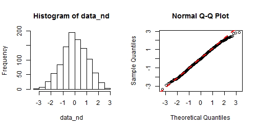

## Introduction: Goal of the project

1. 3 different types of probability distribution shown
2. User can compare these to the normal distribution
3. Histogram of the selected probability distribution will be shown
4. The sumamry describing the histogram and the QQ plots are shown in the adjacent tabs.
5. User can change the color of the bar as well as its edges
6. User can also chose the number of samples to draw from using the slider

--- .class #id 

## Running example-1 developed using knitr


```r
# Take 1000 observations and generate summary--Normal distribution
data_nd <- rnorm(1000); summary(data_nd)
```

```
##      Min.   1st Qu.    Median      Mean   3rd Qu.      Max. 
## -3.344000 -0.682200 -0.024480  0.007163  0.764400  2.870000
```

```r
# generate histogram and Q-Q plot of the data
par(mfrow=c(1,2)); hist(data_nd); qqnorm(data_nd);qqline(data_nd, col = 2,lwd=2,lty=2);
```

 

---

## Running example-2 developed using knitr


```r
# Take 1000 observations and generate summary--Log-Normal distribution
data_lnd <- rlnorm(1000); summary(data_lnd)
```

```
##     Min.  1st Qu.   Median     Mean  3rd Qu.     Max. 
##  0.03166  0.48730  0.98700  1.69400  1.95700 36.49000
```

```r
# generate histogram and Q-Q plot of the data
par(mfrow=c(1,2)); hist(data_lnd); qqnorm(data_lnd);qqline(data_lnd, col = 2,lwd=2,lty=2);
```

 

---
## Shiny app Screenshot
<p>

</p>

 Links to project:
  - [Shiny](http://virendram.shinyapps.io/my_shiny_app/)
  - [Github repository](https://github.com/virendram/data_products_course_project)
  - [Presentation](http://virendram.github.io/data_products_course_project)

